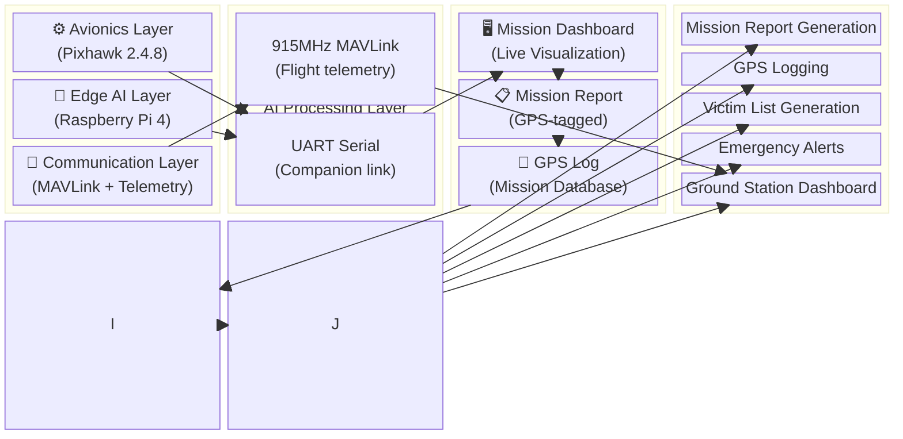
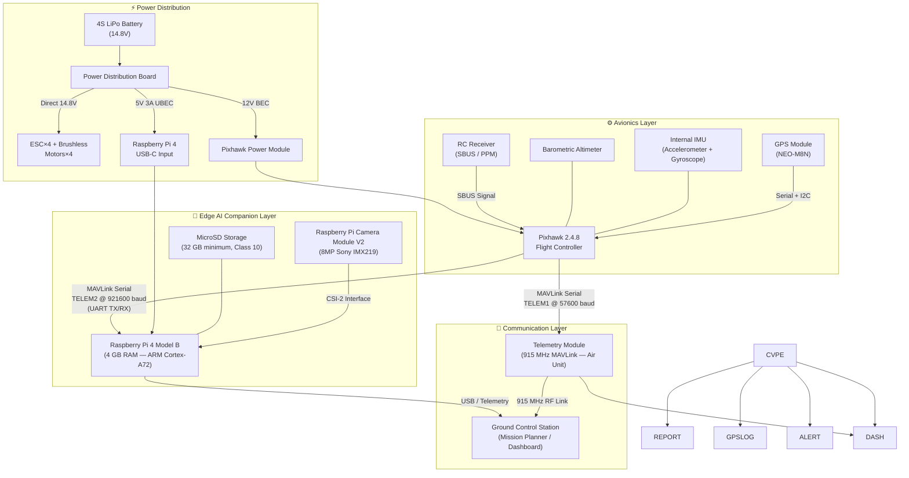
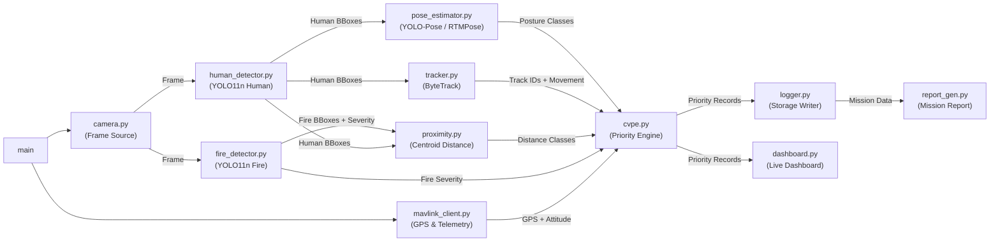

# 📐 System Architecture Specification

## Edge AI-Based UAV for Intelligent Fire Detection and Victim Prioritization during Emergency Response

> **Scope:** This document provides a comprehensive technical description of the system architecture — covering hardware design, AI pipeline, tracking system, the Context-Aware Victim Prioritization Engine (CVPE), software modules, communication protocols, and output interfaces. For project overview, installation, and usage, refer to [README.md](README.md).

---

## 📋 Table of Contents

1. [Architecture Overview](#1-architecture-overview)
2. [System Objective](#2-system-objective)
3. [Hardware Architecture](#3-hardware-architecture)
4. [High-Level Layered Architecture](#4-high-level-layered-architecture)
5. [Complete Data Flow Pipeline](#5-complete-data-flow-pipeline)
6. [AI Modules](#6-ai-modules)
7. [Context-Aware Victim Prioritization Engine (CVPE)](#7-context-aware-victim-prioritization-engine-cvpe)
8. [Proximity Estimation](#8-proximity-estimation)
9. [Why Video is Used Instead of Static Frames](#9-why-video-is-used-instead-of-static-frames)
10. [Software Architecture](#10-software-architecture)
11. [Output Interface](#11-output-interface--mission-dashboard-and-report)
12. [Design Justification](#12-design-justification)
13. [Experimental Pipeline](#13-experimental-pipeline)
14. [Conclusion](#14-conclusion--integrated-edge-ai-rescue-assistance-system)

---

## 1. Architecture Overview

This project describes a low-cost, Edge AI-enabled UAV system designed to operate autonomously during emergency disaster response scenarios. Unlike conventional fire-detection drones that limit their scope to identifying fire presence, this system is designed as a **decision-support platform for emergency responders**.

The UAV performs continuous aerial surveillance of a disaster area and executes a complete onboard processing pipeline: detecting fire, estimating fire severity, detecting nearby humans, estimating their body posture, tracking their movement, measuring their proximity to hazards, and assigning rescue priorities — all in real time, without dependency on cloud infrastructure.

The defining innovation of this architecture is the **Context-Aware Victim Prioritization Engine (CVPE)** — a decision layer that fuses multi-modal AI outputs into actionable rescue priority rankings, enabling first responders to allocate resources optimally under time-critical conditions.



### Architectural Design Principles

| Principle | Implementation |
|---|---|
| **Edge-First Autonomy** | All mission-critical AI inference runs entirely onboard the Raspberry Pi 4. No cloud connectivity is required during active mission operation. |
| **Decision Support, Not Diagnosis** | The system ranks victims by observable conditions — posture, movement, proximity — to guide rescue resource allocation, not to provide medical conclusions. |
| **Research Novelty via CVPE** | The Context-Aware Victim Prioritization Engine is the primary research contribution, differentiating this system from existing fire detection UAVs. |
| **Lightweight Real-Time Models** | YOLO11n variants are selected specifically for their balance of accuracy and inference speed on resource-constrained embedded hardware. |
| **Temporal Awareness** | Continuous video processing enables movement estimation and victim tracking — capabilities impossible with single-frame inference alone. |

---

## 2. System Objective

The UAV continuously monitors a disaster area by streaming video from a **Raspberry Pi Camera Module V2** mounted onboard. The Raspberry Pi 4 companion computer processes this video stream in real time to accomplish the following objectives, in sequence:

1. **Detect fire** in the camera frame and localize it with a bounding box.
2. **Estimate fire severity** based on detection confidence and bounding box area.
3. **Detect nearby humans** in the same frame using an aerial-optimized detection model.
4. **Estimate body posture** of each detected victim — standing, sitting, or lying.
5. **Track movement** of each victim across consecutive video frames.
6. **Estimate proximity to fire** by computing spatial distance between victim and fire centroids.
7. **Assign rescue priorities** using the CVPE by fusing all of the above signals.
8. **Generate GPS-tagged mission reports** documenting victim locations, priorities, and fire zones.

The result is a continuous, real-time stream of structured rescue intelligence delivered to ground operators through a mission dashboard and post-mission report.

---

## 3. Hardware Architecture

### 3.1 Full System Block Diagram



### 3.2 UAV Platform

| Component | Specification |
|---|---|
| **Frame** | S500 quadcopter frame (fiberglass arms, 500 mm motor-to-motor) |
| **Flight Controller** | Pixhawk 2.4.8 running ArduCopter firmware |
| **Battery** | 4S LiPo (14.8V) — capacity selected based on mission endurance requirements |
| **GPS** | NEO-M8N or equivalent GPS/Compass module |
| **Telemetry** | 915 MHz MAVLink telemetry radio (air unit + ground unit pair) |

The S500 frame is selected for its balance of payload capacity, structural rigidity, and low procurement cost — making it suitable for a research-grade prototype deployed in field scenarios.

### 3.3 Companion Computer — Raspberry Pi 4 Model B

The Raspberry Pi 4 (4 GB RAM recommended) serves as the sole onboard compute platform. It is responsible for:

- Capturing and decoding the continuous video stream from the camera.
- Running all AI inference models (fire detection, human detection, pose estimation).
- Executing the ByteTrack tracking algorithm.
- Computing CVPE priority scores for all detected victims.
- Logging GPS-tagged detection events to local storage.
- Generating and transmitting mission reports to the ground dashboard.

The Raspberry Pi 4 Quad-core ARM Cortex-A72 processor at 1.8 GHz provides sufficient throughput for real-time inference using lightweight YOLO11n models optimized for embedded hardware.

### 3.4 Camera — Raspberry Pi Camera Module V2

The Raspberry Pi Camera Module V2 (8 MP, Sony IMX219 sensor) is used as the primary imaging sensor. It connects via the dedicated **CSI-2 (Camera Serial Interface)** ribbon port on the Raspberry Pi 4.

#### Why Raspberry Pi Camera V2 Instead of ESP32-CAM

| Criterion | Raspberry Pi Camera V2 | ESP32-CAM |
|---|---|---|
| **Image Resolution** | 8 MP (3280 × 2464) | 2 MP (1600 × 1200 maximum) |
| **Interface** | CSI-2 (dedicated, low-latency) | SPI / UART (high overhead) |
| **Latency** | Very low — direct memory access via CSI | Higher — network-based transmission adds delay |
| **OpenCV Integration** | Native, full support via picamera2 | Limited, requires MJPEG streaming over Wi-Fi |
| **Real-Time Inference Suitability** | Optimized for continuous video processing pipelines | Insufficient for frame-by-frame AI inference |
| **Driver Maturity** | Officially supported by Raspberry Pi OS | Community drivers, inconsistent performance |

For a system where inference accuracy and temporal continuity are critical, the Raspberry Pi Camera V2 is the most appropriate choice.

### 3.5 Communication — MAVLink over UART

MAVLink is the communication protocol used for all flight telemetry exchange. Two communication paths are established:

1. **Pixhawk → Ground Station (via Telemetry Radio):** The TELEM1 port connects to the 915 MHz air-unit telemetry radio, transmitting flight telemetry to Mission Planner or QGroundControl on the ground.

2. **Pixhawk → Raspberry Pi 4 (via UART Serial):** The TELEM2 port connects directly to the Raspberry Pi 4 GPIO UART pins. The Raspberry Pi reads GPS coordinates and drone attitude data in real time using the pymavlink library.

#### Raspberry Pi 4 ↔ Pixhawk TELEM2 Wiring

| Raspberry Pi 4 Pin | Signal | Pixhawk TELEM2 Pin | Signal |
|:---:|---|:---:|---|
| Pin 8 (GPIO14) | **UART TX** | Pin 3 | **RX** |
| Pin 10 (GPIO15) | **UART RX** | Pin 2 | **TX** |
| Pin 6 | **GND** | Pin 6 | **GND** |

> [!WARNING]
> Raspberry Pi 4 GPIO UART operates at **3.3V logic**. Pixhawk TELEM2 is also 3.3V — no logic-level shifter is required for this connection. Do not connect 5V signal lines directly to any Raspberry Pi GPIO pin.

---

## 4. High-Level Layered Architecture

The system is organized into four functionally distinct layers, each with a clearly defined scope of responsibility.

```
+------------------------------------------------------------------+
|  Layer 4 — Application Layer                                     |
|  Mission Dashboard | GPS Logging | Rescue Report | Alerts        |
+------------------------------------------------------------------+
             ^
             |
+------------------------------------------------------------------+
|  Layer 3 — Decision Layer                                        |
|  Context-Aware Victim Prioritization Engine (CVPE)               |
+------------------------------------------------------------------+
             ^
             |
+------------------------------------------------------------------+
|  Layer 2 — Edge AI Layer                                         |
|  Fire Detection | Human Detection | Pose Estimation | Tracking   |
|  (YOLO11n)      | (YOLO11n)       | (YOLO-Pose /   | (ByteTrack)|
|                 |                 |  RTMPose)      |            |
+------------------------------------------------------------------+
             ^
             |
+------------------------------------------------------------------+
|  Layer 1 — Sensing Layer                                         |
|  Raspberry Pi Camera V2 | GPS Module | Pixhawk Telemetry         |
+------------------------------------------------------------------+
```

| Layer | Responsibility | Key Technologies |
|---|---|---|
| **Sensing** | Raw data acquisition — video, GPS, attitude | Pi Camera V2, GPS module, Pixhawk MAVLink |
| **Edge AI** | Detection, pose estimation, tracking | YOLO11n, YOLO-Pose / RTMPose, ByteTrack |
| **Decision** | Fusing signals into rescue priorities | Context-Aware Victim Prioritization Engine |
| **Application** | Human-facing output — dashboard, logs, reports | Python, dashboard UI, mission report generator |

---

## 5. Complete Data Flow Pipeline

The following pipeline describes the complete processing path from raw camera input to final rescue prioritization output. Each stage is executed sequentially for every processed video frame.

```
Raspberry Pi Camera Module V2
          │
          │  Continuous video stream (CSI-2 interface)
          ▼
+-------------------------------+
|     Continuous Video Stream   |
|   (captured via picamera2)    |
+-------------------------------+
          │
          ▼
+-------------------------------+
|      Frame Preprocessing      |
|  Resize, normalize, BGR→RGB  |
+-------------------------------+
          │
          ▼
+-------------------------------+
|   YOLO11n Fire Detection      |
|  Bounding box + confidence    |
+-------------------------------+
          │
          ▼
+-------------------------------+
|   Fire Severity Estimation    |
|  Area + confidence → severity |
+-------------------------------+
          │
          ▼
+-------------------------------+
|   YOLO11n Human Detection     |
|  Aerial-optimized detection   |
+-------------------------------+
          │
          ▼
+-------------------------------+
|  YOLO-Pose / RTMPose          |
|  Body keypoints → posture     |
+-------------------------------+
          │
          ▼
+-------------------------------+
|     ByteTrack Tracking        |
|  Track ID + movement estimate |
+-------------------------------+
          │
          ▼
+------------------------------------------+
|  Context-Aware Victim Prioritization     |
|  Engine (CVPE)                           |
|  Inputs: pose + movement + proximity +   |
|          fire severity + GPS location    |
|  Output: Rescue priority ranked list     |
+------------------------------------------+
          │
          ▼
+-------------------------------+
|         GPS Logging           |
|  Geotag all detections        |
+-------------------------------+
          │
          ▼
+-------------------------------+
|  Mission Report & Dashboard   |
|  Live view + structured log   |
+-------------------------------+
```

### Stage-by-Stage Description

| Stage | Description |
|---|---|
| **Video Stream** | The Raspberry Pi Camera V2 captures a continuous video stream via the CSI-2 interface. Frames are read sequentially using picamera2 or OpenCV VideoCapture. |
| **Frame Preprocessing** | Each frame is resized to the model input resolution, color-converted from BGR to RGB, and normalized to the appropriate dtype. |
| **Fire Detection** | YOLO11n runs inference on the preprocessed frame and outputs bounding boxes around detected fire and smoke regions with confidence scores. |
| **Fire Severity Estimation** | Severity is estimated by computing a normalized score based on bounding box area relative to total frame area and detection confidence. |
| **Human Detection** | A second YOLO11n model fine-tuned on aerial drone imagery detects humans within the same frame, outputting bounding boxes and confidence scores. |
| **Pose Estimation** | YOLO-Pose or RTMPose predicts body keypoints for each detected person, classified into Standing, Sitting, or Lying. |
| **ByteTrack Tracking** | ByteTrack assigns persistent track IDs to each person across frames and estimates movement from centroid displacement between frames. |
| **CVPE** | The Context-Aware Victim Prioritization Engine combines posture, movement, fire proximity, fire severity, and GPS location to assign a rescue priority to each victim. |
| **GPS Logging** | All detections are tagged with current drone GPS coordinates from Pixhawk MAVLink and written to local storage. |
| **Report & Dashboard** | Final output is streamed to the mission dashboard and compiled into a structured mission report. |

---

## 6. AI Modules

### 6.1 Fire Detection Module

**Model:** YOLO11n — the smallest and fastest variant of the YOLO11 family, optimized for embedded inference on resource-constrained hardware.

#### Training Datasets

| Dataset | Role | Justification |
|---|---|---|
| **DFire** | Primary training dataset | Contains annotated fire and smoke bounding boxes in YOLO-compatible format. Provides diverse fire scenarios across indoor and outdoor environments. Directly compatible with YOLO training workflows, making it the most practical choice for this task. |
| **FLAME** | Secondary / supplementary dataset | A wildfire-focused aerial dataset that improves model robustness for outdoor and large-scale fire scenarios — conditions directly relevant to UAV emergency response operations. |

#### Output

| Output | Description |
|---|---|
| **Fire bounding box** | Pixel coordinates [x1, y1, x2, y2] around detected fire or smoke region |
| **Confidence score** | Detection confidence in [0.0, 1.0] used as severity input to the CVPE |
| **Fire severity** | Normalized score derived from bounding box area and confidence — Low / Medium / High |

---

### 6.2 Human Detection Module

**Model:** YOLO11n — fine-tuned on aerial drone imagery for overhead perspective human detection.

#### Training Datasets

| Dataset | Role | Justification |
|---|---|---|
| **VisDrone** | Primary training dataset | Contains thousands of annotated aerial drone images with human detections captured from UAV platforms. This is the most relevant available dataset for aerial human detection — directly matching this system’s operational viewpoint. |
| **COCO** | Pretrained weights + generalization | Provides robust pretrained backbone weights through transfer learning. Improves generalization to diverse human appearances and occlusion conditions. |

#### Output

| Output | Description |
|---|---|
| **Human bounding boxes** | Pixel coordinates [x1, y1, x2, y2] for each detected person |
| **Confidence scores** | Per-person detection confidence in [0.0, 1.0] |

---

### 6.3 Pose Estimation Module

**Model:** YOLO-Pose or RTMPose — real-time multi-person body keypoint estimation suitable for embedded deployment via ONNX export.

#### Training Datasets

| Dataset | Role | Justification |
|---|---|---|
| **COCO Keypoints** | Primary training dataset | Provides 17 standardized body keypoints per person across a large and diverse image corpus. The benchmark dataset for human pose estimation — reliable and extensively validated. |
| **MPII Human Pose** | Secondary dataset | Broader range of human activities and orientations. Improves robustness across unconventional postures such as collapsed or partially obscured individuals — conditions expected in disaster scenarios. |

#### Output — Observable Posture Classes

| Posture Class | Observable Condition |
|:---:|---|
| **Standing** | Person is upright; torso and limbs are approximately vertical. |
| **Sitting** | Person is partially upright; lower body is bent; reduced height relative to shoulder width. |
| **Lying** | Person is horizontal; torso and limbs are approximately at the same elevation. |

> [!IMPORTANT]
> These posture classifications represent **observable physical conditions** identified from body keypoint geometry — not medical diagnoses. The system provides rescue decision support based on visible indicators only. Medical assessment remains the responsibility of on-ground emergency personnel.

---

### 6.4 Person Tracking — ByteTrack

ByteTrack is a high-performance multi-object tracking algorithm that associates detections across frames using both high-confidence and low-confidence detection boxes, reducing identity switches and track loss in crowded or occluded scenes.

#### Purpose in This System

| Function | Description |
|---|---|
| **Maintain victim identity** | Assigns a persistent track ID to each detected person, maintained across all frames throughout the mission. |
| **Estimate movement** | Computes bounding box centroid displacement between consecutive frames. Sustained displacement indicates walking; rapid displacement indicates running; near-zero displacement indicates a stationary victim. |
| **Avoid duplicate counting** | Prevents the same person from being logged multiple times in the priority queue. |
| **Measure displacement over time** | Temporal displacement data feeds into the CVPE to determine movement status. |

> [!NOTE]
> Walking and running states are **not** determined by a separate action-recognition model. They are estimated purely by measuring the displacement of a victim’s bounding box centroid across consecutive video frames. This design keeps the inference pipeline lightweight and avoids the additional latency of a dedicated action-recognition stage.

---

## 7. Context-Aware Victim Prioritization Engine (CVPE)

The **Context-Aware Victim Prioritization Engine (CVPE)** is the primary research contribution of this project. It constitutes the central decision layer of the architecture, transforming raw AI inference outputs into structured, actionable rescue priority rankings.

The CVPE distinguishes this system from existing fire detection UAVs by incorporating multi-modal contextual signals about each victim’s physical condition, mobility, and hazard exposure — producing a rescue priority that reflects a holistic assessment of each individual’s risk level.

### 7.1 CVPE Inputs

For each detected victim, the CVPE receives the following inputs:

| Input | Source Module | Description |
|---|---|---|
| **Fire severity** | Fire Detection Module | Normalized score [0.0, 1.0] representing fire magnitude and confidence |
| **Victim pose** | Pose Estimation Module | Posture class: Standing, Sitting, or Lying |
| **Victim movement** | ByteTrack Tracking | Movement status: Stationary, Walking, or Running |
| **Distance from fire** | Proximity Estimator | Spatial class: Near, Medium, or Far |
| **Number of nearby victims** | Human Detection Module | Count of other detected victims within the same frame region |
| **GPS location** | Pixhawk MAVLink | Geotagged coordinates of the victim’s estimated ground position |

### 7.2 Priority Mapping Table

| Pose | Movement | Fire Distance | Priority Class |
|:---:|:---:|:---:|:---:|
| Running | High | Far | 🟢 **Low** |
| Walking | Moderate | Medium | 🟢 **Low** |
| Walking | Moderate | Near | 🟡 **Medium** |
| Standing | Low | Far | 🟢 **Low** |
| Standing | Low | Medium | 🟡 **Medium** |
| Standing | Low | Near | 🟡 **Medium** |
| Sitting | Low | Far | 🟡 **Medium** |
| Sitting | Low | Near | 🔴 **High** |
| Lying | None | Far | 🔴 **High** |
| Lying | None | Near | 🚨 **Critical** |

#### Priority Rationale

- **Running + Far:** Victim is mobile and not immediately threatened. High probability of self-rescue.
- **Walking + Moderate:** Victim has mobility and may navigate to safety independently.
- **Standing + Near Fire:** Victim is conscious and stable but is in a hazardous zone and cannot safely navigate without assistance.
- **Sitting + Near Fire:** Victim has limited mobility and is at elevated risk due to proximity to the fire.
- **Lying + Near Fire:** Victim shows no movement and is in immediate proximity to the fire. Requires immediate extraction — highest priority.

### 7.3 CVPE Decision Flowchart

```mermaid
flowchart TD
    A(["🎯 New Detection Frame Processed"]) --> B{"Victims\nDetected?"}
    B -- No --> Z(["⏭️ Skip — Await Next Frame"])
    B -- Yes --> C["📡 Fetch UAV GPS, Altitude, Heading\nfrom Pixhawk via MAVLink"]

    C --> D["🗺️ Geotag Each Victim Estimated\nGround Position"]

    D --> E{"Fire Zones\nDetected?"}
    E -- Yes --> F["📏 Compute Centroid Distance\nbetween Victim and Nearest Fire Box"]
    E -- No --> G["Set Fire Distance = Far\nFire Severity = 0.0"]

    F --> H["🏷️ Classify Distance:\nNear / Medium / Far"]
    G --> H

    H --> I["🤾 Read Pose Class\n(Standing / Sitting / Lying)"]
    I --> J["📌 Read Movement Status from ByteTrack\n(Stationary / Walking / Running)"]
    J --> K["🔥 Read Fire Severity Score"]

    K --> L["⚖️ Apply CVPE Scoring Rules\nPose × Movement × Distance × Severity"]

    L --> M["🏷️ Assign Priority Class\nCritical / High / Medium / Low"]

    M --> N["📋 Insert Victim Record\ninto Ranked Priority Queue"]

    N --> O["💾 Write GPS-Tagged\nVictim Record to Local Storage"]

    O --> P(["📡 Push to Mission Dashboard"])

    style A fill:#1a1a2e,stroke:#e94560
    style L fill:#16213e,stroke:#0f3460
    style M fill:#0f3460,stroke:#533483
    style P fill:#1a2d00,stroke:#44cc00
```



### 7.4 CVPE Output Record

For each victim, the CVPE produces a structured record:

```json
{
  "track_id": 3,
  "rescue_rank": 1,
  "pose": "Lying",
  "movement": "Stationary",
  "fire_distance": "Near",
  "fire_severity": "High",
  "priority_class": "Critical",
  "estimated_gps": {
    "lat": 13.0827,
    "lon": 80.2707
  },
  "frame_bbox": [120, 240, 210, 390],
  "first_seen_ts": "2026-08-07T08:15:30Z",
  "consecutive_frames": 42
}
```

> [!IMPORTANT]
> The CVPE provides **decision support for emergency responders**, not autonomous deployment decisions. Priority rankings guide human rescue coordinators in allocating resources efficiently. All life-critical decisions remain under human authority.

---

## 8. Proximity Estimation

Proximity estimation determines how close each detected victim is to the nearest detected fire zone. It operates entirely within the 2D image plane using the bounding box outputs of the fire and human detection models.

### 8.1 Centroid Computation

For each bounding box [x1, y1, x2, y2], the centroid is:

$$C_x = \frac{x_1 + x_2}{2}, \quad C_y = \frac{y_1 + y_2}{2}$$

This is applied to both the fire bounding box and the victim bounding box.

### 8.2 Euclidean Distance

The pixel-space Euclidean distance between the victim centroid $(V_x, V_y)$ and the nearest fire centroid $(F_x, F_y)$:

$$D_{pixel} = \sqrt{(V_x - F_x)^2 + (V_y - F_y)^2}$$

### 8.3 Distance Classification

| Class | Condition | CVPE Interpretation |
|:---:|---|---|
| **Near** | $D_{pixel}$ is small (bounding boxes overlap or are adjacent) | Immediate hazard exposure — high urgency input to CVPE |
| **Medium** | $D_{pixel}$ is moderate (victim is within the same scene region as fire) | Elevated risk — moderate urgency |
| **Far** | $D_{pixel}$ is large (victim and fire are in opposite regions of the frame) | Lower immediate risk from fire |

> [!NOTE]
> This proximity estimation is image-plane based and is an approximation of true physical distance. It is intentionally lightweight to meet real-time processing requirements on embedded hardware. For deployments requiring metric accuracy, GPS-based haversine distance computation may be substituted.

---

## 9. Why Video is Used Instead of Static Frames

A fundamental design decision in this system is the use of a **continuous video stream** rather than isolated image captures. This is architecturally necessary for three reasons.

### 9.1 Tracking Requires Temporal Continuity

ByteTrack can only assign and maintain consistent victim identity (track IDs) by associating detections across consecutive frames. A single frame provides no temporal context — the tracker cannot determine whether two detected people in separate images are the same individual. Video continuity is a prerequisite for all victim tracking functionality.

### 9.2 Movement Estimation Requires Frame Sequences

The distinction between a stationary victim and a walking or running victim — one of the most important inputs to the CVPE — cannot be determined from any single frame. Movement is measured by computing the displacement of a victim’s bounding box centroid across multiple consecutive frames. This is only possible with a temporally ordered sequence of frames: a video stream.

Without movement estimation, the CVPE cannot distinguish between a victim lying unconscious and a victim momentarily lying down. This distinction directly affects the priority class assigned.

### 9.3 Rescue Prioritization Depends on Behavioral Patterns

Rescue prioritization is not based on a single-moment snapshot. A victim classified as Walking has been observed moving consistently across multiple frames. A victim classified as Stationary has had near-zero displacement over a sustained observation window. These are behavioral characterizations that require temporal observation — not single-frame inferences.

### 9.4 Implementation

The Raspberry Pi Camera Module V2 captures a continuous video stream via the CSI-2 interface, read frame by frame using picamera2 or OpenCV VideoCapture API. Each frame passes through the full AI pipeline sequentially. The video is not stored in full — only per-frame detection results, victim records, and GPS-tagged events are written to local storage.

---

## 10. Software Architecture

### 10.1 Software Stack

| Layer | Technology | Role |
|---|---|---|
| **Operating System** | Raspberry Pi OS (64-bit) | Base OS for all onboard processing |
| **Language** | Python 3.11+ | Primary implementation language |
| **Computer Vision** | OpenCV 4.x | Frame capture, preprocessing, visualization |
| **Deep Learning** | PyTorch (ONNX / TorchScript export) | Model inference backend |
| **Fire and Human Detection** | YOLO11n (Ultralytics) | Bounding box detection |
| **Pose Estimation** | YOLO-Pose or RTMPose | Body keypoint estimation |
| **Person Tracking** | ByteTrack | Multi-object tracking across frames |
| **MAVLink Communication** | pymavlink | GPS and telemetry data from Pixhawk |
| **Ground Control** | Mission Planner | Flight planning, telemetry visualization |

### 10.2 Module Dependency Graph



### 10.3 Module Descriptions

| Module | Responsibility | Key Output |
|---|---|---|
| `camera.py` | Reads frames from Raspberry Pi Camera V2 via CSI-2 | BGR numpy array per frame |
| `fire_detector.py` | Runs YOLO11n inference for fire and smoke detection | Fire bounding boxes + severity score |
| `human_detector.py` | Runs YOLO11n inference for aerial human detection | Human bounding boxes |
| `pose_estimator.py` | Runs YOLO-Pose / RTMPose on detected human regions | Posture class per victim |
| `tracker.py` | Runs ByteTrack to assign track IDs and estimate movement | Track ID + movement status per victim |
| `proximity.py` | Computes centroid distance between victims and fire zones | Distance class (Near / Medium / Far) |
| `cvpe.py` | Applies CVPE scoring rules to all victim signals | Ranked priority list |
| `mavlink_client.py` | Reads GPS and attitude data from Pixhawk via UART | GPS coordinates, altitude, heading |
| `logger.py` | Writes GPS-tagged victim and fire records to local storage | Persistent mission log |
| `report_gen.py` | Generates structured mission report from logged data | Mission report document |
| `dashboard.py` | Renders live mission dashboard with detections and priorities | Real-time visualization |

---

## 11. Output Interface — Mission Dashboard and Report

### 11.1 Live Mission Dashboard

The mission dashboard provides real-time situational awareness to ground operators during an active mission.

| Panel | Content |
|---|---|
| **Live Video Feed** | Annotated camera stream with bounding boxes, track IDs, posture labels, and priority badges overlaid |
| **Fire Location** | Fire bounding boxes highlighted with severity-coded color (yellow → orange → red) |
| **Fire Severity** | Normalized severity level: Low / Medium / High |
| **Victim Locations** | Individual victim bounding boxes with track IDs and priority class indicators |
| **Victim Pose** | Standing / Sitting / Lying label per detected victim |
| **Movement Status** | Stationary / Walking / Running classification per tracked victim |
| **Rescue Priority** | Color-coded priority badge: 🟢 Low / 🟡 Medium / 🔴 High / 🚨 Critical |
| **GPS Coordinates** | Estimated ground coordinates for each fire zone and victim |
| **Mission Timeline** | Timestamped log of all detections, priority assignments, and system events |

### 11.2 Generated Mission Report

At mission conclusion, the system generates a structured report documenting all prioritized victims and fire zones with GPS locations.

**Example Mission Report:**

```
====================================================
   MISSION REPORT — EdgeFireUAV
   Mission ID : MISSION-20260807-0815
   Date/Time  : 2026-08-07 08:15:00 UTC
   Duration   : 00:12:47
====================================================

FIRE ASSESSMENT
  Fire Zones Detected : 1
  Peak Severity       : High
  Fire GPS            : 13.0825° N, 80.2705° E

----------------------------------------------------
VICTIM PRIORITY REPORT  (sorted by rescue rank)
----------------------------------------------------

  Rescue Rank   : 1
  Pose          : Lying
  Movement      : Stationary
  Fire Distance : Near
  Priority      : 🚨 CRITICAL
  GPS           : 13.0827° N, 80.2707° E

  Rescue Rank   : 2
  Pose          : Sitting
  Movement      : Stationary
  Fire Distance : Near
  Priority      : 🔴 HIGH
  GPS           : 13.0829° N, 80.2710° E

  Rescue Rank   : 3
  Pose          : Standing
  Movement      : Low
  Fire Distance : Medium
  Priority      : 🟡 MEDIUM
  GPS           : 13.0831° N, 80.2714° E

  Rescue Rank   : 4
  Pose          : Running
  Movement      : High
  Fire Distance : Far
  Priority      : 🟢 LOW
  GPS           : 13.0835° N, 80.2720° E

====================================================
   Total Victims Detected : 4
   Critical: 1  |  High: 1  |  Medium: 1  |  Low: 1
====================================================
```

---

## 12. Design Justification

| Component | Selection Reason |
|---|---|
| **Raspberry Pi Camera Module V2** | 8 MP resolution with CSI-2 interface provides low-latency, high-quality video suitable for real-time AI inference. Superior to USB or Wi-Fi camera alternatives in latency and driver stability. |
| **Raspberry Pi 4 Model B** | Sufficient edge AI compute capability for lightweight YOLO inference. Low cost, widely supported, suitable for embedded UAV deployment. |
| **YOLO11n** | Smallest and fastest YOLO11 variant — optimized for real-time inference on resource-constrained embedded hardware while maintaining competitive detection accuracy. |
| **DFire Dataset** | Annotated fire and smoke bounding boxes in YOLO format with diverse fire scenarios. Direct match for the fire detection training task. |
| **FLAME Dataset** | Aerial wildfire imagery. Improves robustness in large-scale outdoor fire scenarios relevant to UAV operations. |
| **VisDrone Dataset** | Aerial drone imagery with annotated humans. The only available large-scale dataset that directly matches the operational UAV viewing angle of this system. |
| **COCO Dataset** | Large, diverse human appearance dataset. Provides pretrained backbone weights and improves generalization through transfer learning. |
| **COCO Keypoints** | 17-point standardized body keypoint annotations. The benchmark dataset for human pose estimation — reliable and extensively validated. |
| **MPII Human Pose** | Diverse activity and posture coverage. Improves robustness in non-standard postures expected in disaster scenarios. |
| **YOLO-Pose / RTMPose** | Real-time multi-person pose estimation with low latency. Compatible with embedded deployment through ONNX export. |
| **ByteTrack** | State-of-the-art multi-object tracker using both high- and low-confidence detections to minimize track loss. Enables movement estimation without a separate action-recognition model. |
| **CVPE** | The primary research innovation. Enables the system to generate actionable rescue priorities by fusing multi-modal AI signals — going beyond fire detection to provide integrated rescue decision support. |
| **S500 Frame** | Cost-effective quadcopter platform with adequate payload capacity for the Raspberry Pi 4, camera, and battery. |
| **Pixhawk 2.4.8** | Open-source flight controller with MAVLink support. Provides reliable GPS, attitude, and telemetry data to the companion computer. |

---

## 13. Experimental Pipeline

### Training Infrastructure

All AI model training is performed on a **PC workstation equipped with a CUDA-enabled GPU**. The training pipeline involves:

1. Dataset preparation and annotation verification for DFire, FLAME, VisDrone, COCO, COCO Keypoints, and MPII.
2. Fine-tuning YOLO11n on the fire detection dataset (DFire + FLAME).
3. Fine-tuning YOLO11n on the human detection dataset (VisDrone + COCO transfer learning).
4. Training or fine-tuning YOLO-Pose or RTMPose on COCO Keypoints + MPII.
5. Exporting all models to ONNX or TorchScript format for embedded deployment.

### Deployment

Trained and exported models are deployed to the Raspberry Pi 4. All inference runs **locally onboard the UAV** during flight. No internet connection or cloud API is used during real-time operation.

### Validation

| Validation Type | Description |
|---|---|
| **Public Dataset Benchmarks** | Models are evaluated on held-out test splits of DFire, VisDrone, COCO Keypoints, and MPII for standard accuracy metrics (mAP, Top-1 accuracy). |
| **Custom Drone Video Validation** | Aerial footage captured using the UAV platform and manually annotated to evaluate end-to-end pipeline accuracy in realistic deployment conditions. |
| **CVPE Rule Validation** | Priority assignments are verified against expert-defined scenarios to confirm that rule mappings produce expected priority outcomes for all pose-movement-distance combinations. |
| **Inference Latency Profiling** | Per-module inference time is measured on the Raspberry Pi 4 to confirm the pipeline meets real-time processing requirements. |

---

## 14. Conclusion — Integrated Edge AI Rescue Assistance System

This project is not simply a fire detection drone.

It is a fully integrated **Edge AI rescue assistance system** — designed from the ground up to address the complete information needs of emergency responders in disaster scenarios. By combining five distinct AI capabilities into a single, lightweight, cost-effective UAV platform, this system delivers a qualitatively different class of situational intelligence:

| Capability | Technology |
|---|---|
| **Fire Detection and Severity Estimation** | YOLO11n (DFire + FLAME) |
| **Aerial Human Localization** | YOLO11n (VisDrone + COCO) |
| **Body Pose Estimation** | YOLO-Pose / RTMPose (COCO Keypoints + MPII) |
| **Victim Movement Analysis** | ByteTrack multi-object tracking |
| **Fire Proximity Estimation** | Centroid-based distance classification |
| **Context-Aware Rescue Prioritization** | Context-Aware Victim Prioritization Engine (CVPE) |

The **Context-Aware Victim Prioritization Engine** is the architectural centerpiece that elevates this system beyond conventional fire detection. It synthesizes all upstream AI signals into a ranked rescue priority list that tells emergency responders not just where the fire is, but **who needs help first, how urgently, and where they are located** — all computed autonomously onboard, in real time, without requiring any cloud infrastructure.

This architecture demonstrates that sophisticated rescue intelligence can be delivered from a low-cost, embedded UAV platform — making it practically deployable in real-world emergency response operations where cost, portability, and reliability are critical constraints.

---

*Architecture Specification v2.0 — Edge AI-Based UAV for Intelligent Fire Detection and Victim Prioritization — Basil Joseph and Grace Maria James — 2026*
