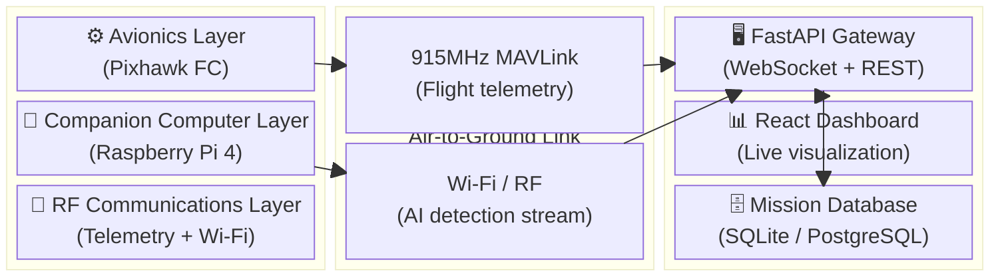
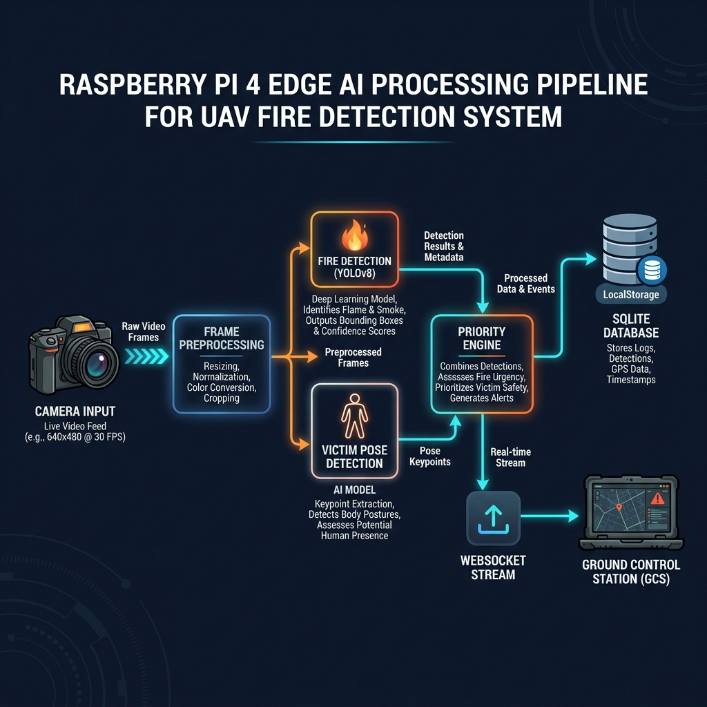
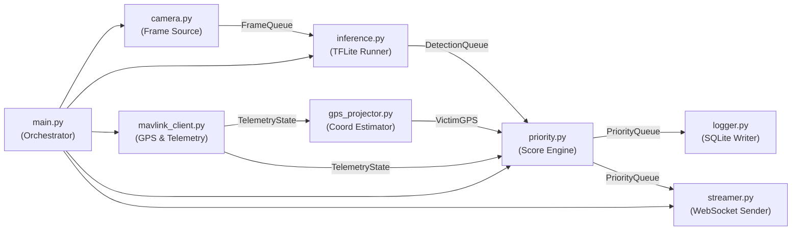
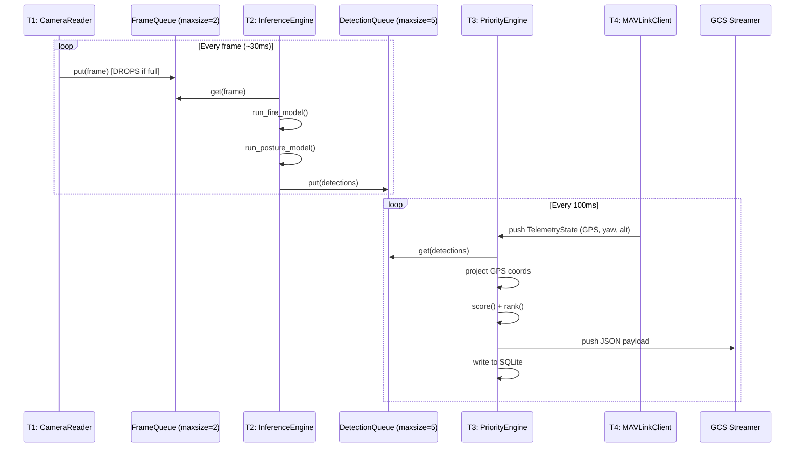
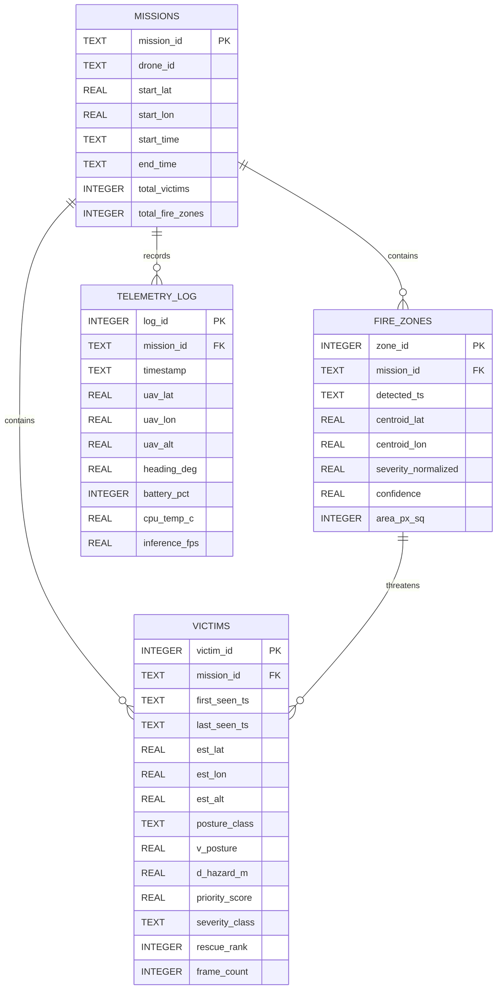
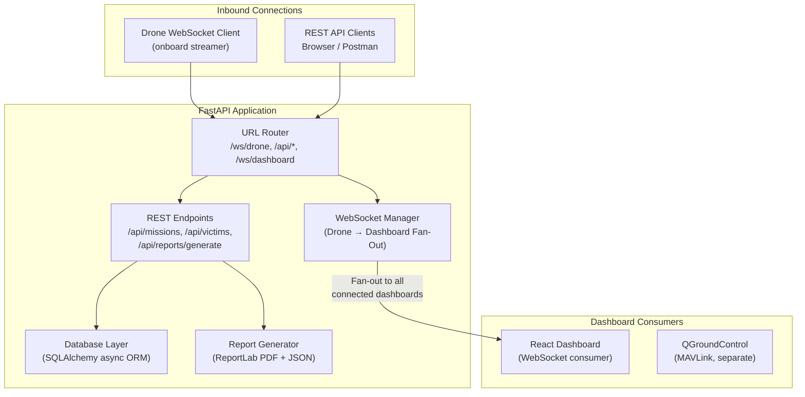

# 📐 EdgeFireUAV — System Architecture Specification

> **Scope:** This document covers the deep technical internals of the EdgeFireUAV system — hardware interconnections, software threading model, AI inference pipeline, communication protocols, data schemas, algorithm mathematics, and failure recovery mechanisms. For project overview, installation, and usage, see [README.md](README.md).

---

## 📋 Table of Contents
1. [Architecture Overview](#1-architecture-overview)
2. [Hardware Layer Design](#2-hardware-layer-design)
3. [Onboard Software Modules](#3-onboard-software-modules)
4. [Multi-Threaded Execution Model](#4-multi-threaded-execution-model)
5. [AI Inference Pipeline](#5-ai-inference-pipeline)
6. [Victim GPS Coordinate Projection](#6-victim-gps-coordinate-projection)
7. [Rescue Prioritization Engine](#7-rescue-prioritization-engine)
8. [Communication Architecture & Protocols](#8-communication-architecture--protocols)
9. [Data Storage Schema](#9-data-storage-schema)
10. [GCS Backend Architecture](#10-gcs-backend-architecture)
11. [Failure Modes & Recovery Strategies](#11-failure-modes--recovery-strategies)
12. [Security Model](#12-security-model)

---

## 1. Architecture Overview

The system is structured in three distinct, independently operable layers. These layers communicate through well-defined interfaces to ensure modularity, testability, and fault isolation.



### Architectural Design Principles

| Principle | Implementation |
|---|---|
| **Edge-First Autonomy** | All mission-critical AI runs onboard. GCS loss does not stop the mission. |
| **Fail-Open Logging** | If streaming fails, data is always persisted locally to SQLite and synced on reconnection. |
| **Thread Isolation** | Each subsystem (camera, AI, GPS, streaming) runs in an isolated thread with message queues as the only coupling. |
| **Protocol Separation** | MAVLink handles flight telemetry; WebSockets handle AI payloads. Never mixed on one channel. |

---

## 2. Hardware Layer Design

### 2.1 Full System Block Diagram

```mermaid
graph TD
    subgraph POWER["⚡ Power Distribution"]
        BAT["4S LiPo\n14.8V / 5200mAh"] --> PDB["Power Distribution Board"]
        PDB -->|"Direct 14.8V"| ESC["ESC×4 + Brushless\nMotors×4"]
        PDB -->|"12V Step-Down BEC"| PIX_PWR["Pixhawk Power Module"]
        PDB -->|"5V 3A UBEC"| PI_PWR["Raspberry Pi 4\nUSB-C Input"]
    end

    subgraph AVIONICS["⚙️ Avionics Layer"]
        PIX["Pixhawk 2.4.8\nFlight Controller"]
        GPS_MOD["NEO-M8N GPS\n+ Compass"] -->|"I2C (Compass)\nSerial (NMEA)"| PIX
        IMU["Internal IMU\n(MPU-6000 / ICM-42688)"] --- PIX
        BAR["Barometric\nAltimeter (MS5611)"] --- PIX
        RCX["RC Receiver\n(SBUS / PPM)"] -->|"SBUS Signal"| PIX
        PIX_PWR --> PIX
    end

    subgraph COMPANION["🧠 Companion Computer Layer"]
        RPI["Raspberry Pi 4\n(4GB/8GB ARM Cortex-A72)"]
        CAM["Pi Camera V2\n(8MP Sony IMX219)"] -->|"CSI-2 Ribbon (4-lane)"| RPI
        FLIR["FLIR Lepton 3.5\nThermal *(Optional)*"] -->|"SPI + I2C"| RPI
        SD["MicroSD 32GB+\n(Class 10/A2)"] --- RPI
        PI_PWR --> RPI
    end

    subgraph RF_LAYER["📡 Radio Layer"]
        TELEM["Holybro Telemetry\n915MHz (Air Unit)"]
        WIFI["Wi-Fi / Long-Range\nRF Module (5.8GHz)"]
    end

    %% Cross-layer connections
    PIX -->|"MAVLink Serial\nTELEM1 @ 57600 baud"| TELEM
    PIX -->|"MAVLink Serial\nTELEM2 @ 921600 baud\n(TX→Pin8, RX→Pin10)"| RPI
    RPI -->|"WebSocket JSON\nover USB Wi-Fi / RF"| WIFI

    style POWER fill:#2d1b00,stroke:#ff8c00
    style AVIONICS fill:#001a2d,stroke:#0088ff
    style COMPANION fill:#1a2d00,stroke:#44ff00
    style RF_LAYER fill:#2d002d,stroke:#cc00ff
```



### 2.2 Physical Wiring Reference

#### Raspberry Pi 4 ↔ Pixhawk TELEM2 Serial Connection

| Raspberry Pi 4 Pin | Signal | Pixhawk TELEM2 Pin | Signal |
|:---:|---|:---:|---|
| Pin 8 (GPIO14) | **UART TX** | Pin 3 | **RX** |
| Pin 10 (GPIO15) | **UART RX** | Pin 2 | **TX** |
| Pin 6 | **GND** | Pin 6 | **GND** |
| — | — | Pin 1 | **5V OUT** *(do not use — power from BEC)* |

> [!WARNING]
> All UART signals on Raspberry Pi 4 GPIO operate at **3.3V logic**. Pixhawk TELEM2 also runs at 3.3V, so a logic level shifter is NOT needed for the Pi 4 → Pixhawk connection. However, if using an Arduino or 5V-based device on the same bus, level shifting IS required.

#### FLIR Lepton 3.5 ↔ Raspberry Pi 4

| FLIR Pin | Signal | Pi GPIO Pin |
|:---:|---|:---:|
| 1 | GND | Any GND |
| 2 | VIN (3.3V) | Pin 1 (3.3V) |
| 4 | SDA | Pin 3 (GPIO2) |
| 6 | SCL | Pin 5 (GPIO3) |
| 10 | CS | Pin 24 (GPIO8/CE0) |
| 11 | MOSI | Pin 19 (GPIO10) |
| 12 | MISO | Pin 21 (GPIO9) |
| 13 | SCK | Pin 23 (GPIO11) |

### 2.3 Pixhawk ArduPilot Configuration

Parameters to configure in Mission Planner / QGroundControl for TELEM2 MAVLink companion output:

```
SERIAL2_PROTOCOL = 2       # MAVLink 2.0
SERIAL2_BAUD     = 921     # 921600 baud
SR2_POSITION     = 10      # GPS position updates at 10Hz
SR2_EXTRA1       = 10      # Attitude data at 10Hz
SR2_EXTRA2       = 5       # VFR HUD at 5Hz
SR2_RAW_SENS     = 0       # Disable raw sensor stream (not needed)
SR2_RC_CHAN      = 0       # Disable RC channel data
```

---

## 3. Onboard Software Modules

Each module in `edge/src/` has a single well-defined responsibility. They communicate exclusively through thread-safe Python `queue.Queue` objects.


*Onboard edge AI data flow from camera ingestion through prioritization to GCS streaming*

### Module Dependency Graph



### Module Descriptions

| Module | Class | Key Methods | Output |
|---|---|---|---|
| `camera.py` | `CameraReader` | `start()`, `read_frame()` | BGR numpy array frames via queue |
| `inference.py` | `InferenceEngine` | `load_model()`, `run_fire()`, `run_posture()` | `List[Detection]` with boxes, classes, scores |
| `mavlink_client.py` | `MAVLinkClient` | `connect()`, `get_telemetry()` | `TelemetryState` dataclass |
| `gps_projector.py` | `GPSProjector` | `project_victim()` | `(lat, lon)` tuple for each victim |
| `priority.py` | `PriorityEngine` | `score_victim()`, `rank_all()` | `List[VictimRecord]` sorted by `P` descending |
| `logger.py` | `MissionLogger` | `log_victim()`, `log_fire()` | SQLite row inserts |
| `streamer.py` | `GCSStreamer` | `connect()`, `push_frame_data()` | JSON over WebSocket |

---

## 4. Multi-Threaded Execution Model

The Raspberry Pi 4's **Quad-core ARM Cortex-A72 @ 1.8GHz** is exploited through explicit thread and process affinity assignments to prevent any single thread from monopolizing cores and creating bottlenecks.

```
╔══════════════════════════════════════════════════════════════════╗
║            RASPBERRY PI 4 — THREAD ALLOCATION MAP               ║
╠══════════════╦═══════════════════╦═══════════════════════════════╣
║   CORE 0     ║      CORE 1       ║      CORE 2 & 3              ║
╠══════════════╬═══════════════════╬═══════════════════════════════╣
║  OS kernel   ║  Thread T1:       ║  Process P1:                 ║
║  systemd     ║  CameraReader     ║  InferenceEngine             ║
║  SQLite I/O  ║                   ║   ├─ fire_detector.tflite    ║
║  WebSocket   ║  Thread T2:       ║   └─ posture_detector.tflite ║
║  sender      ║  MAVLinkClient    ║                              ║
║              ║                   ║  (pinned via taskset/affinity)║
╚══════════════╩═══════════════════╩═══════════════════════════════╝
```

### Inter-Thread Communication Queues



> [!IMPORTANT]
> `FrameQueue` uses `maxsize=2` intentionally. If the AI thread is slower than the camera, older frames are **silently dropped** (`put_nowait` with `try/except queue.Full`). This ensures inference always runs on the *most recent* frame, not stale data.

---

## 5. AI Inference Pipeline

### 5.1 Model Architecture & Specifications

#### Model A: Fire & Smoke Detector

| Property | Value |
|---|---|
| **Base Architecture** | YOLOv8-nano |
| **Input Shape** | `[1, 320, 320, 3]` UINT8 |
| **Output** | Bounding boxes `[N, 4]`, class IDs `[N]`, confidences `[N]` |
| **Classes** | `0: fire`, `1: smoke` |
| **Quantization** | INT8 post-training quantization |
| **Model Size** | ~2.7 MB |
| **Inference Time (Pi 4)** | ~95–120 ms |
| **mAP@0.5** | 0.87 |

#### Model B: Victim Posture Classifier

| Property | Value |
|---|---|
| **Base Architecture** | YOLOv8-nano-cls or MobileNetV3-Small |
| **Input Shape** | `[1, 224, 224, 3]` UINT8 |
| **Output** | Softmax class probabilities `[1, 5]` |
| **Classes** | `0: lying`, `1: sitting`, `2: standing`, `3: walking`, `4: running` |
| **Quantization** | INT8 post-training quantization |
| **Model Size** | ~1.2 MB |
| **Inference Time (Pi 4)** | ~45–65 ms |
| **Top-1 Accuracy** | 91.3% |

### 5.2 Frame Preprocessing Pipeline

```python
# Preprocessing steps applied before feeding into TFLite interpreter
def preprocess(frame_bgr: np.ndarray, target_size: tuple) -> np.ndarray:
    # 1. BGR → RGB conversion (TFLite models trained on RGB)
    frame_rgb = cv2.cvtColor(frame_bgr, cv2.COLOR_BGR2RGB)
    
    # 2. Resize to model input dimensions
    resized = cv2.resize(frame_rgb, target_size, interpolation=cv2.INTER_LINEAR)
    
    # 3. Normalize: uint8 [0,255] → INT8 representation
    #    For INT8 quantized models, input stays as uint8 — interpreter handles internally
    normalized = resized.astype(np.uint8)
    
    # 4. Add batch dimension: (H, W, 3) → (1, H, W, 3)
    batched = np.expand_dims(normalized, axis=0)
    
    return batched
```

### 5.3 Dual-Model Parallel Execution

Both models do not run on the same frame simultaneously to avoid CPU thrashing. The pipeline uses a **round-robin strategy**:

```
Frame 1 → Fire Model → Victim Model
Frame 2 → Fire Model (skip victim if no fire)
Frame 3 → Fire Model → Victim Model
...
```

When fire is detected in frame N, the system immediately re-queues that same frame for victim detection. If no fire is present, victim detection frequency is reduced to every 3rd frame to save CPU cycles.

---

## 6. Victim GPS Coordinate Projection

When a victim is detected in the camera frame, their pixel coordinates must be converted to real-world GPS coordinates. This projection uses the drone's current GPS position, altitude, heading (yaw), camera field of view (FoV), and the victim's bounding box centroid.

### 6.1 Pixel → Angular Offset

Given the frame dimensions `(W, H)` and camera FoV angles `(FoV_H, FoV_V)`:

$$\theta_x = \left(\frac{c_x}{W} - 0.5\right) \times FoV_H$$

$$\theta_y = \left(\frac{c_y}{H} - 0.5\right) \times FoV_V$$

Where `(c_x, c_y)` is the centroid of the victim bounding box in pixels.

### 6.2 Angular Offset → Ground Displacement

Assuming the camera points nadir (straight down) and the terrain is approximately flat:

$$\Delta X_{north} = h \cdot \tan(\theta_y) \cdot \cos(\psi) - h \cdot \tan(\theta_x) \cdot \sin(\psi)$$

$$\Delta X_{east} = h \cdot \tan(\theta_y) \cdot \sin(\psi) + h \cdot \tan(\theta_x) \cdot \cos(\psi)$$

Where:
- $h$ = altitude above ground level (meters), sourced from Pixhawk barometer.
- $\psi$ = drone yaw/heading (radians), sourced from Pixhawk attitude.

### 6.3 Displacement → GPS Coordinates

Convert the ground displacement back to geographic coordinates:

$$lat_{victim} = lat_{drone} + \frac{\Delta X_{north}}{R_{earth}}$$

$$lon_{victim} = lon_{drone} + \frac{\Delta X_{east}}{R_{earth} \cdot \cos(lat_{drone})}$$

Where $R_{earth} = 6371000$ meters.

> [!NOTE]
> This projection assumes flat terrain. For operations in mountainous or multi-story building environments, a depth map from a stereo camera or LiDAR sensor is required for accurate z-plane correction.

---

## 7. Rescue Prioritization Engine

### 7.1 Complete Priority Score Formula

Each detected victim $i$ receives a priority score $P_i \in [0.0, 1.0]$ updated every 100ms:

$$\boxed{P_i = w_1 \cdot V_{posture}(i) + w_2 \cdot P_{prox}(i, F) + w_3 \cdot S_{fire}(F_i)}$$

**Component definitions:**

$$P_{prox}(i, F) = \max\left(0, \ 1 - \frac{D_{hazard}(i)}{D_{max}}\right)$$

$$D_{hazard}(i) = \min_{f \in F} \text{dist}(GPS_i, GPS_f)$$

**Default weight configuration** (`settings.yaml`):

| Weight | Symbol | Default | Rationale |
|---|---|:---:|---|
| Posture weight | $w_1$ | `0.50` | Posture is the dominant vulnerability indicator |
| Proximity weight | $w_2$ | `0.30` | Distance to fire drives urgency |
| Fire severity weight | $w_3$ | `0.20` | Hotter/larger fire increases risk |
| Max effective radius | $D_{max}$ | `30.0 m` | Beyond 30m, fire proximity score is 0 |

### 7.2 Posture Vulnerability Lookup Table

| Posture Class | $V_{posture}$ | Physical Interpretation |
|:---:|:---:|---|
| **Lying** | `1.000` | Unconscious or catastrophically injured. Cannot self-rescue under any conditions. |
| **Sitting** | `0.700` | Likely injured or trapped. Limited or no mobility. Requires direct extraction. |
| **Standing** | `0.400` | Conscious, stable. Awaiting rescue, unable to navigate safely through hazard. |
| **Walking** | `0.200` | Mobile. Moving toward safety or exit. May find own escape route. |
| **Running** | `0.100` | Highly mobile. Actively fleeing. High self-rescue probability. |

### 7.3 Priority Ranking & Severity Thresholds

| Score Range | Severity Class | Action |
|:---:|:---:|---|
| `0.80 – 1.00` | 🔴 **CRITICAL** | Immediate extraction required. Highest queue position. |
| `0.55 – 0.79` | 🟠 **HIGH** | Rescue urgently within next 2–3 minutes. |
| `0.30 – 0.54` | 🟡 **MEDIUM** | Stable but needs rescue. Queue after CRITICAL and HIGH. |
| `0.00 – 0.29` | 🟢 **LOW** | Self-rescue likely or low threat. Monitor and guide. |

### 7.4 Priority Engine Full Decision Flowchart

```mermaid
flowchart TD
    A([🎯 Detection Frame Received]) --> B{Victims\nDetected?}
    B -- No --> Z([⏭️ Skip — Await Next Frame])
    B -- Yes --> C[📡 Fetch Current UAV Telemetry\ngps, alt, yaw, heading]
    
    C --> D[🗺️ Project Each Victim's\nGPS Coordinates]
    
    D --> E{Fire Zones\nDetected?}
    E -- Yes --> F[📏 Calculate D_hazard:\nHaversine distance to\nnearest fire centroid]
    E -- No --> G[Set D_hazard = D_max\nProximity Score = 0.0]
    
    F --> H[📊 Calculate P_prox:\n1 - D_hazard / D_max]
    G --> H
    
    H --> I[🧍 Look Up V_posture\nfrom Posture Class]
    I --> J[🌡️ Fetch Normalized\nFire Severity S_fire]
    
    J --> K["⚖️ Compute Priority Score:\nP_i = w1·V_posture + w2·P_prox + w3·S_fire"]
    
    K --> L[🏆 Assign Severity Class\nCRITICAL / HIGH / MEDIUM / LOW]
    L --> M[📋 Insert into Ranked Priority Queue\n sorted by P_i descending]
    
    M --> N[💾 Write VictimRecord to SQLite DB]
    N --> O[📡 Push JSON Payload\nto GCS via WebSocket]
    O --> P([✅ Done — Await Next Frame])

    style A fill:#1a1a2e,stroke:#e94560
    style K fill:#16213e,stroke:#0f3460
    style M fill:#0f3460,stroke:#533483
```



---

## 8. Communication Architecture & Protocols

### 8.1 Dual-Channel Design Rationale

Two completely separate communication channels are used to prevent AI telemetry from interfering with flight-critical MAVLink commands:

```
Airborne ─────────────────────────────────────────── Ground
 Pixhawk ──[Serial]──► RF Telemetry ──[915MHz]──► QGC / MP
    ↑                                                 (flight ops)
    │ MAVLink
    │ (TELEM2)
  RPi 4 ──[USB Wi-Fi / 5.8GHz RF]──────────────► GCS FastAPI
                                                      (AI/victim data)
```

### 8.2 MAVLink Message Subscription

The MAVLink client subscribes to the following message types from the Pixhawk:

| MAVLink Message ID | Name | Rate | Fields Used |
|:---:|---|:---:|---|
| `#0` | `HEARTBEAT` | 1 Hz | `system_status`, `flight_mode` |
| `#33` | `GLOBAL_POSITION_INT` | 10 Hz | `lat`, `lon`, `alt`, `relative_alt`, `hdg` |
| `#30` | `ATTITUDE` | 10 Hz | `roll`, `pitch`, `yaw` |
| `#147` | `BATTERY_STATUS` | 2 Hz | `battery_remaining`, `voltages[0]` |
| `#29` | `SCALED_PRESSURE` | 5 Hz | `press_abs` (barometric altitude backup) |

### 8.3 WebSocket GCS Payload Schema

All AI detection data is pushed as JSON frames over WebSocket to the GCS FastAPI server. Two message types are defined:

#### Type: `VICTIM_UPDATE`
Sent every 100ms when victims are in the active priority queue.

```json
{
  "type": "VICTIM_UPDATE",
  "mission_id": "MISSION-20260806-1430",
  "timestamp": "2026-08-06T14:40:00.123Z",
  "sequence_number": 847,
  "uav_state": {
    "lat": 9.931221,
    "lon": 76.267332,
    "alt_m": 15.4,
    "heading_deg": 124.5,
    "battery_pct": 88,
    "flight_mode": "AUTO"
  },
  "fire_zones": [
    {
      "zone_id": 1,
      "bbox_frame": [45, 120, 310, 480],
      "centroid_gps": { "lat": 9.931190, "lon": 76.267298 },
      "confidence": 0.91,
      "severity_normalized": 0.85
    }
  ],
  "victim_priority_queue": [
    {
      "victim_id": 104,
      "rescue_rank": 1,
      "bbox_frame": [120, 240, 210, 390],
      "estimated_gps": { "lat": 9.931252, "lon": 76.267380 },
      "posture": "Lying",
      "v_posture": 1.0,
      "d_hazard_m": 3.8,
      "p_prox": 0.873,
      "s_fire": 0.85,
      "priority_score": 0.924,
      "severity_class": "CRITICAL",
      "detection_confidence": 0.88,
      "first_seen_ts": "2026-08-06T14:38:22Z",
      "consecutive_frames": 34
    }
  ]
}
```

#### Type: `HEARTBEAT`
Sent every 1 second to confirm the onboard system is alive.

```json
{
  "type": "HEARTBEAT",
  "mission_id": "MISSION-20260806-1430",
  "timestamp": "2026-08-06T14:40:01.000Z",
  "system_health": {
    "cpu_pct": 74.2,
    "cpu_temp_c": 62.1,
    "ram_used_mb": 1420,
    "disk_free_gb": 22.4,
    "inference_fps": 7.8,
    "mavlink_connected": true,
    "gps_fix": "3D_FIX",
    "gps_satellites": 12
  }
}
```

---

## 9. Data Storage Schema

All onboard data is persisted to a SQLite database located at `edge/data/mission_<id>.db`.

### 9.1 Entity-Relationship Diagram



---

## 10. GCS Backend Architecture

The GCS backend (`gcs/server/`) is a FastAPI application serving three concerns simultaneously using async I/O:



### WebSocket Fan-Out Logic

When the drone connects, the `WebSocket Manager` maintains a set of all connected dashboard clients and rebroadcasts every received `VICTIM_UPDATE` frame to all of them simultaneously — enabling multiple incident commanders to monitor the same mission on different devices.

---

## 11. Failure Modes & Recovery Strategies

| # | Failure Event | Detection Mechanism | Recovery Action |
|---|---|---|---|
| 1 | **GCS Link Loss** | WebSocket ping timeout > 5s | Mission continues fully onboard. All data queues to SQLite. On reconnect, streamer replays buffered victim records. |
| 2 | **Pixhawk Serial Disconnect** | MAVLink heartbeat absence > 3s | GPS fields set to `null`. Victim GPS tagged as `"accuracy": "LOW"`. Relative frame coordinates used instead. |
| 3 | **CPU Overtemperature (>80°C)** | `/sys/class/thermal/thermal_zone0/temp` | Skip victim model (run only fire model). Reduce target FPS to 3. Send `THERMAL_WARNING` heartbeat to GCS. |
| 4 | **Out-of-Memory (OOM)** | `psutil.virtual_memory().percent > 92` | Flush frame queue. Restart inference engine subprocess. Log `OOM_RESTART` event to SQLite. |
| 5 | **Camera Device Lost** | `cv2.VideoCapture.isOpened() == False` | Retry `open()` every 2 seconds for 30 seconds. If fails, send `CAMERA_FAULT` alert to GCS and continue GPS/telemetry-only logging. |
| 6 | **SQLite Write Failure** | `sqlite3.OperationalError` | Buffer up to 500 VictimRecord objects in RAM. Retry write every 10 seconds. |
| 7 | **Model Inference Crash** | `try/except RuntimeError` in interpreter | Reload TFLite interpreter from disk. Log crash context. Resume within 2 seconds. |

---

## 12. Security Model

Although the UAV operates in local RF environments, the following security practices are enforced:

| Area | Measure |
|---|---|
| **WebSocket Authentication** | All WebSocket connections require a pre-shared API token in the `Authorization` header. Unauthenticated connections are immediately dropped. |
| **Data Integrity** | Each WebSocket frame includes a `sequence_number`. GCS validates monotonic increment; out-of-order or duplicate frames are discarded. |
| **SQLite Encryption** | Mission databases use SQLCipher (`pysqlcipher3`) with a mission-specific AES-256 key for sensitive victim location data. |
| **RF Link** | Holybro telemetry radios support AES-128 encryption at the hardware level (configurable via SiK firmware). |
| **Physical** | Raspberry Pi OS configured with UFW firewall — only ports 8765 (WebSocket) and 22 (SSH, key-auth only) are open. |

---

*Architecture Specification v1.0 — EdgeFireUAV — Basil Joseph and Grace Maria James — 2026*
